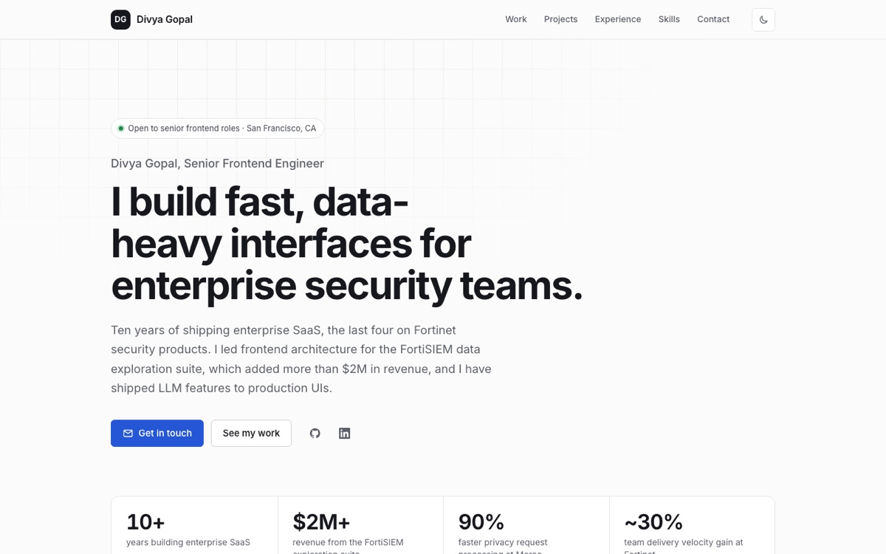

# divyagopalnadar.github.io

Personal site of **Divya Gopal**, Senior Frontend Engineer. Live at
**[divyagopalnadar.github.io](https://divyagopalnadar.github.io)**.



## Stack

- **React 19 + TypeScript** (strict), bundled with **Vite**
- **CSS Modules** with a small design-token layer (`src/styles/global.css`); light and dark themes with no flash on load
- **Vitest + Testing Library** for content and behaviour tests
- **oxlint** for linting
- **GitHub Actions** runs lint, typecheck, tests and build on every push, then deploys `main` to GitHub Pages

No UI framework and no runtime dependencies beyond React. The production bundle is about 76 kB gzipped.

## Structure

```
src/
  content/       All copy as typed data (profile.ts), so edits never touch components
  components/    One component per section, each with a co-located CSS module
  hooks/         useTheme: system preference, persisted override
  styles/        Design tokens and base styles
```

To update the site, edit `src/content/profile.ts`. To show a résumé download button, add the PDF to
`public/` and set `resumeUrl: '/resume.pdf'` on `profile`.

## Accessibility

Semantic landmarks and heading order, a skip link, visible focus styles, labelled icon buttons,
descriptive alt text, and `prefers-reduced-motion` support. The tests check the heading structure,
the nav targets and the external link attributes.

## Development

```bash
npm install
npm run dev        # http://localhost:5173
npm run check      # lint + typecheck + tests
npm run build      # production build to dist/
```

## Deployment

Pushing to `main` deploys through `.github/workflows/deploy.yml`. One-time setup: in the repository's
**Settings → Pages**, set **Source** to **GitHub Actions**.
